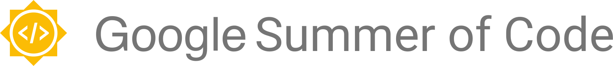

<p align="center">
       
</p>
<p align="center"><b>Community archive of accepted GSoC 2025 proposals from VJTI Mumbai for reference and inspiration for fellow Juniors and New Contributors</b></p>

> **Note**: This README is automatically updated! The proposal count, organization list, and contributors are maintained by GitHub Actions whenever new proposals are added or PRs are merged.
# GSoC Proposal Collection

This repository hosts and maintains the list of Google Summer of Code (GSoC) proposals submitted by various organizations and contributors.

---

## 📊 Repository Stats

- Total proposals submitted: **5** _(auto-updated)_

---
## Contributing a Proposal

1. **Fork this repository** using the "Fork" button at the top right.
2. **Clone your fork** to your local machine:

   ```
   git clone https://github.com/YOUR_USERNAME/YOUR_FORK.git
   ```

3. **Navigate to the repository**:

   ```
   cd GSoC_archive_2025
   ```

4. **Add the upstream repository**:

   ```
   git remote add upstream https://github.com/geeky33/GSoC_archive_2025.git
   ```

5. **Sync your fork** with the main repository:

   ```
   git pull upstream main --rebase
   ```

6. **Create a new branch** for your changes:

   ```
   git checkout -b add-proposal-<org_name>
   ```

7. **Add your proposal**:
   - Create a folder named after the organization if it doesn't exist.
   - Place your proposal PDF inside this folder.
   - Rename your proposal PDF to: `<Project-Name>_GSoC_Proposal_<Year>.pdf`

8. **Commit and push your changes**:

   ```
   git add .
   git commit -m "Add proposal for <org_name>"
   git push origin add-proposal-<org_name>
   ```

9. **Create a pull request**:
   - Go to your forked repository on GitHub.
   - Click the "Compare & pull request" button for your branch.
   - Submit the pull request.
   - Run the updated readme python file
          python .github/scripts/update_readme.py

That's it. Your work could help someone get in next year.

---

## ✅ Org Submission Checklist


<!-- This list is automatically updated from the directory structure -->

---

## 🧑‍💻 Contributors
<!-- Add contributors below -->


<div align="center">
  <a href="https://github.com/username1"></a>
  <a href="https://github.com/username2"></a>
</div>

